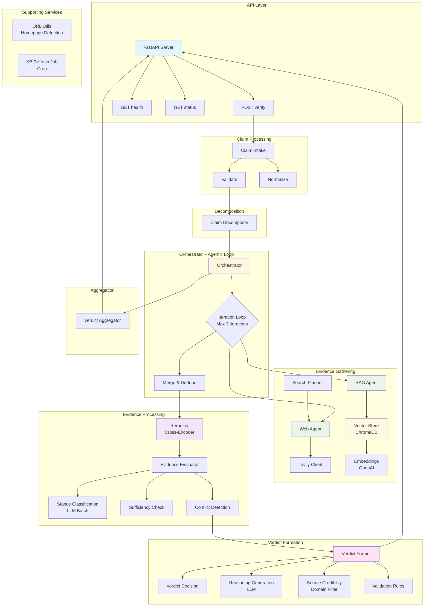
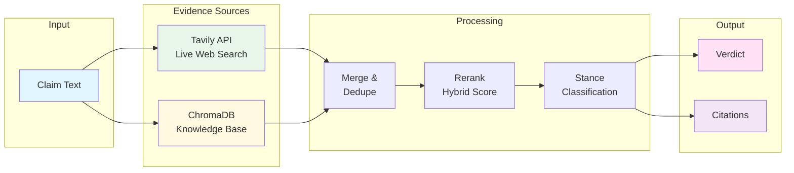

# Architecture Diagram - Mermaid Code

## Complete System Architecture

**Note:** Decomposition is LLM-based: the Claim Decomposer is asked to extract sub-claims for claims above a small length threshold. When it returns multiple sub-claims, the Orchestrator runs verification for each and the Verdict Aggregator combines results into one response including `sub_results` for the UI. When it returns one sub-claim, the response comes from Verdict Former directly.

## Evidence Flow Diagram

